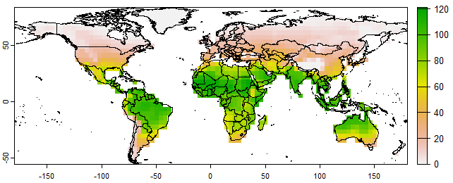
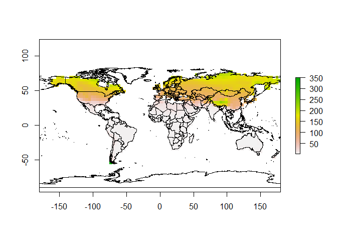

    ## install and loading packages

    library(devtools)

    install_github('gpzhu/PhenMap')

    library(phenMap)
    
    library(terra)

    library(rgdal)

    library(sp)

    library(raster)

    library(rnaturalearth)

    library(rnaturalearthdata)

    ## read system file in phenMap package

    tmax <-rast(system.file("extdata", "tmax.tif", package="phenMap"))
    tmin <-rast(system.file("extdata", "tmin.tif", package="phenMap"))
    tavg<-rast(system.file("extdata", "tavg.tif", package="phenMap"))

    ### read globe polygon map

    glb <- ne_countries(scale = "medium", returnclass = "sf")

    ######################################################################################
    #### Mapping number of generation based on basal temperature and growing degree days

    # DVD0 basal temperature/low threshold development temperature, based on which insect start to develop

    # GDD growing degree days of egg to adult

    # stk, which is stack raster of grid daily mean temperature, SpatRaster object (1-365 days basis)

    gen<-Gen(DVD0=10, GDD=60, stk=tavg) ##This is the parameter of coding moth

    
    ##################################################################
    #### Mapping emergence date of insect after overwintering

    # tasmax stack raster of grid daily maximum temperature, SpatRaster object (1-365 days basis)

    # tasmin stack raster of grid daily minimum temperature, SpatRaster object (1-365 days basis)

    # DVD0 basal temperature/low threshold development temperature, based on which insect start to develop

    # GDD growing degree days of egg to adult
    

    emg<-emerg(DVD0=10, GDD=60, tasmax=tmax, tasmin=tmin) ##This is the parameter of coding moth

    
    ###########################################################
    ## Plot of number of generation

    plot(gen)
    plot(glb,add=T)

    ## Plot of emergence date

    plot(emg)
    plot(glb,add=T)

