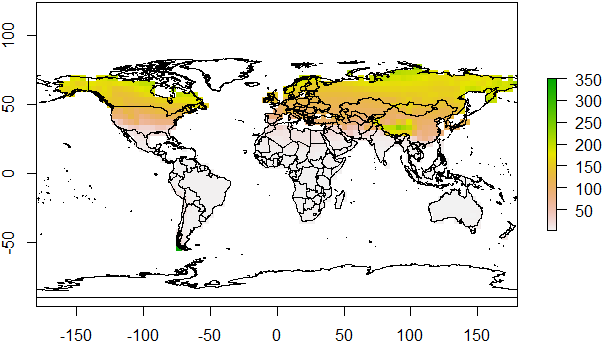

    ## install and loading packages

    library(devtools)

    ## Loading required package: usethis

    install_github('gpzhu/PhenMap')

    ## Skipping install of 'phenMap' from a github remote, the SHA1 (91deefaf) has not changed since last install.
    ##   Use `force = TRUE` to force installation

    library(phenMap)
    library(terra)

    ## terra 1.7.39

    library(rgdal)

    ## Loading required package: sp

    ## The legacy packages maptools, rgdal, and rgeos, underpinning the sp package,
    ## which was just loaded, will retire in October 2023.
    ## Please refer to R-spatial evolution reports for details, especially
    ## https://r-spatial.org/r/2023/05/15/evolution4.html.
    ## It may be desirable to make the sf package available;
    ## package maintainers should consider adding sf to Suggests:.
    ## The sp package is now running under evolution status 2
    ##      (status 2 uses the sf package in place of rgdal)

    ## Please note that rgdal will be retired during October 2023,
    ## plan transition to sf/stars/terra functions using GDAL and PROJ
    ## at your earliest convenience.
    ## See https://r-spatial.org/r/2023/05/15/evolution4.html and https://github.com/r-spatial/evolution
    ## rgdal: version: 1.6-7, (SVN revision 1203)
    ## Geospatial Data Abstraction Library extensions to R successfully loaded
    ## Loaded GDAL runtime: GDAL 3.6.2, released 2023/01/02
    ## Path to GDAL shared files: C:/Users/ThinkPad/AppData/Local/R/win-library/4.3/rgdal/gdal
    ##  GDAL does not use iconv for recoding strings.
    ## GDAL binary built with GEOS: TRUE 
    ## Loaded PROJ runtime: Rel. 9.2.0, March 1st, 2023, [PJ_VERSION: 920]
    ## Path to PROJ shared files: C:\Program Files\PostgreSQL\13\share\contrib\postgis-3.0\proj
    ## PROJ CDN enabled: FALSE
    ## Linking to sp version:2.0-0
    ## To mute warnings of possible GDAL/OSR exportToProj4() degradation,
    ## use options("rgdal_show_exportToProj4_warnings"="none") before loading sp or rgdal.

    ## 
    ## Attaching package: 'rgdal'

    ## The following object is masked from 'package:terra':
    ## 
    ##     project

    library(raster)

    library(rnaturalearth)

    ## Support for Spatial objects (`sp`) will be deprecated in {rnaturalearth} and will be removed in a future release of the package. Please use `sf` objects with {rnaturalearth}. For example: `ne_download(returnclass = 'sf')`

    library(rnaturalearthdata)

    ## 
    ## Attaching package: 'rnaturalearthdata'

    ## The following object is masked from 'package:rnaturalearth':
    ## 
    ##     countries110

    ## read system file in phenMap package

    tmax <-rast(system.file("extdata", "tmax.tif", package="phenMap"))
    tmin <-rast(system.file("extdata", "tmin.tif", package="phenMap"))
    tavg<-rast(system.file("extdata", "tavg.tif", package="phenMap"))

    ### read globe polygon map

    glb <- ne_countries(scale = "medium", returnclass = "sp")

    ## Warning: The `returnclass` argument of `ne_download()` sp as of rnaturalearth 1.0.0.
    ## ℹ Please use `sf` objects with {rnaturalearth}, support for Spatial objects
    ##   (sp) will be removed in a future release of the package.
    ## This warning is displayed once every 8 hours.
    ## Call `lifecycle::last_lifecycle_warnings()` to see where this warning was
    ## generated.

    #### Mapping number of generation based on basal temperature and growing degree days

    # DVD0 basal temperature/low threshold development temperature, based on which insect start to develop

    # GDD growing degree days of egg to adult

    # stk, which is stack raster of grid daily mean temperature, SpatRaster object (1-365 days basis)

    gen<-Gen(DVD0=10, GDD=60, stk=tavg) ##This is the parameter of coding moth

    gen<-Gen(DVD0=10, GDD=60, stk=tavg) ##This is the parameter of coding moth

    #### Mapping emergence date of insect after overwintering

    # tasmax stack raster of grid daily maximum temperature, SpatRaster object (1-365 days basis)

    # tasmin stack raster of grid daily minimum temperature, SpatRaster object (1-365 days basis)

    # DVD0 basal temperature/low threshold development temperature, based on which insect start to develop

    # GDD growing degree days of egg to adult

    emg<-emerg(DVD0=10, GDD=60, tasmax=tmax, tasmin=tmin) ##This is the parameter of coding moth

    ## Plot of number of generation

    plot(gen)
    plot(glb,add=T)

    ## Plot of emergence date

    plot(emg)
    plot(glb,add=T)

